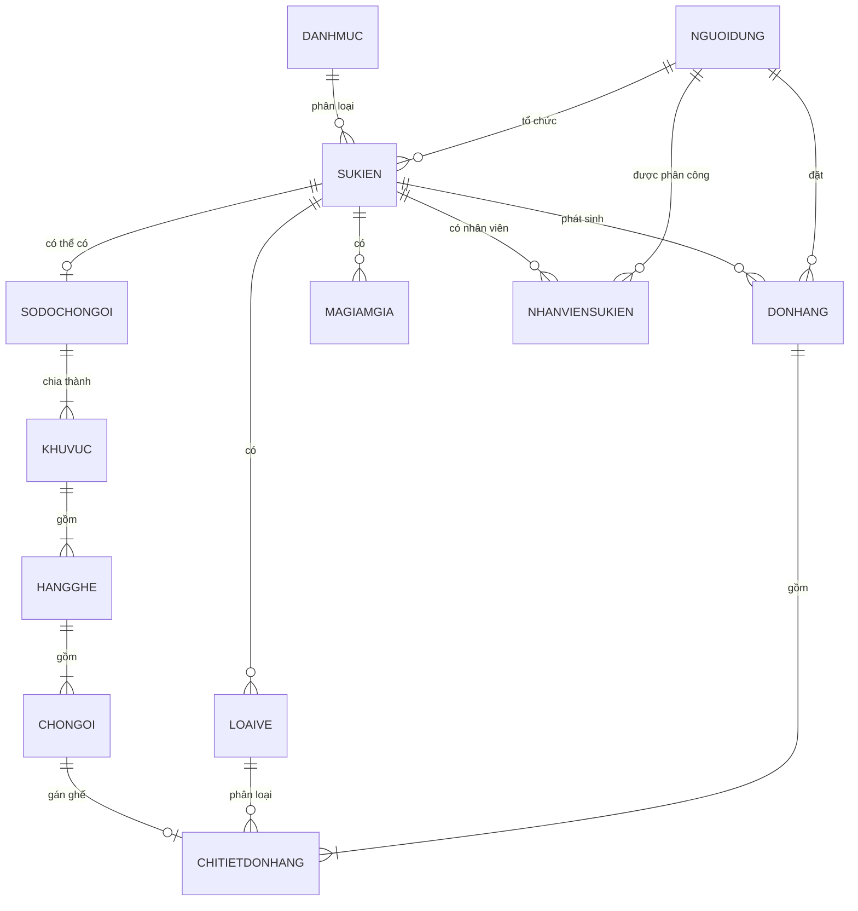

# Kịch bản phản biện WuangEvents — đúng 15 phút

## A. Chuẩn bị trước khi vào phòng

### 1. Chạy dữ liệu demo

Khoảng 5–10 phút trước khi trình bày, chạy:

`CHUAN_BI_DON_CHO_DEMO.cmd`

File này sẽ:

- mở lại **WuangEvents Live 2026** để demo mua ghế;
- căn sự kiện Jazz vào khung check-in 10:00–11:30;
- đặt `VE-JAZZ-THUONG-4` về trạng thái chưa check-in;
- tạo lại đơn chờ thanh toán còn khoảng 9 phút.

### 2. Mở sẵn bốn cửa sổ trình duyệt

Mật khẩu chung: `123456`.

| Cửa sổ | Tài khoản | Màn hình mở sẵn |
|---|---|---|
| Khách hàng | `buyer1@wuangevents.com` | Vé của tôi |
| Ban tổ chức | `organizer1@wuangevents.com` | Sự kiện của tôi |
| Soát vé | `staff1@wuangevents.com` | Sự kiện được phân công |
| Quản trị viên | `admin@wuangevents.com` | Dashboard admin |

Ngoài ra mở một cửa sổ chưa đăng nhập tại trang chủ. Phóng trình duyệt 90–100%, tắt thông báo và không mở Visual Studio trong phần trình bày chính trừ khi thầy yêu cầu xem code.

## B. Phân bổ 15 phút

| Thời gian | Nội dung |
|---|---|
| 0:00–2:15 | Mô tả mong muốn và kết quả đề tài |
| 2:15–4:45 | Mô hình dữ liệu ý niệm |
| 4:45–13:15 | Demo phần mềm |
| 13:15–15:00 | Tổng kết, giới hạn và hướng phát triển |

---

# 1. Mô tả mong muốn và kết quả — 2 phút 15 giây

## Lời nói gần như nguyên văn

> Kính thưa thầy, đề tài của em là WuangEvents, một website quản lý sự kiện và đặt vé trực tuyến hướng đến người dùng Việt Nam.
>
> Bài toán em giải quyết là gom quy trình tổ chức sự kiện về một hệ thống thống nhất, từ tạo và xét duyệt sự kiện, cấu hình loại vé và sơ đồ ghế, bán vé hoặc đăng ký miễn phí, thanh toán, quản lý khách tham dự cho đến check-in và báo cáo doanh thu.
>
> Hệ thống có bốn vai trò. Khách hàng tìm sự kiện trực tiếp hoặc trực tuyến, chọn vé hoặc ghế và quản lý đơn. Ban tổ chức quản lý toàn bộ nghiệp vụ của sự kiện. Nhân viên chỉ được soát vé cho sự kiện được phân công. Quản trị viên duyệt ban tổ chức, duyệt sự kiện và quản lý dữ liệu hệ thống.
>
> Kết quả hiện tại là một quy trình xuyên suốt. Vé miễn phí được xác nhận ngay mà không qua cổng thanh toán. Vé có phí chỉ chuyển sang chờ thanh toán khi khách thực sự bấm thanh toán và được giữ tối đa 10 phút. Sự kiện trực tiếp phát hành QR để check-in; sự kiện trực tuyến cấp quyền vào phòng cho đơn hợp lệ và không dùng QR tại cổng.
>
> Em tập trung vào các ràng buộc như không bán trùng ghế, không bán vượt số lượng, không check-in hai lần, không cho người khác quản lý sự kiện không thuộc quyền sở hữu và không cho thay đổi cấu trúc vé hoặc ghế khi dữ liệu đơn hàng có thể bị ảnh hưởng.

Không nói về hoàn tiền vì nghiệp vụ này chưa thuộc phạm vi hiện thực.

---

# 2. Mô hình dữ liệu ý niệm — 2 phút 30 giây

## Sơ đồ quan hệ cần trình chiếu

## Lời nói

> Trung tâm mô hình là SựKiện. Mỗi sự kiện thuộc một ban tổ chức và một danh mục; một sự kiện có nhiều loại vé, mã giảm giá và đơn hàng.
>
> Em tách ĐơnHàng và ChiTiếtĐơnHàng vì một lần đặt có thể mua nhiều vé. Đơn hàng lưu tổng tiền, giảm giá, phương thức và trạng thái thanh toán. Mỗi chi tiết là một vé riêng, có người tham dự, mã vé, QR, trạng thái check-in và có thể gắn một ghế.
>
> Nếu sự kiện có chọn chỗ, dữ liệu đi theo cấu trúc SơĐồChỗNgồi, KhuVực, HàngGhế và ChỗNgồi. Khu vực liên kết với LoạiVé nên hệ thống không bị giới hạn ở hai loại Thường và VIP. Ban tổ chức có thể tạo nhiều loại vé và gán mỗi khu cho loại phù hợp.
>
> NhânViênSựKiện là bảng nối nhiều-nhiều vì một sự kiện có nhiều nhân viên và một nhân viên có thể được phân công cho nhiều sự kiện.
>
> Khóa ngoại bảo đảm quan hệ dữ liệu; mã đơn, mã vé và QR là duy nhất; tiền dùng DECIMAL để tránh sai số; thời gian dùng DATETIME2. Dapper chạy SQL có tham số để ánh xạ kết quả sang model C# và hạn chế SQL injection.

Nếu thầy hỏi vì sao không gộp ĐơnHàng và ChiTiếtĐơnHàng: “Một đơn mua ba vé thì có một dòng đơn hàng và ba dòng chi tiết. Nhờ tách bảng, từng người và từng vé có ghế, QR, trạng thái check-in riêng.”

---

# 3. Demo phần mềm — 8 phút 30 giây

## 3.1. Khách chưa đăng nhập — 40 giây

Thao tác:

1. Mở trang chủ.
2. Chỉ nhanh tìm kiếm và phân loại **Trực tiếp/Trực tuyến**.
3. Chuyển sang khám phá để chỉ sự kiện sắp diễn ra và sự kiện đã kết thúc.
4. Mở chi tiết một sự kiện và chỉ nút mua vé.

Nói:

> Trang chủ ưu tiên sự kiện sắp diễn ra nhưng người dùng vẫn tìm được sự kiện cũ để tham khảo. Nếu chưa đăng nhập mà bấm mua vé, hệ thống chuyển tới đăng nhập và giữ địa chỉ quay lại thay vì báo Not Found.

Không đăng nhập ở cửa sổ này; chuyển ngay sang cửa sổ buyer1.

## 3.2. Khách hàng buyer1 — 2 phút

### Vé của tôi

1. Mở **Vé của tôi**.
2. Chuyển nhanh các tab Tất cả, Hoàn tất, Chờ thanh toán, Đã hủy và Hết hạn.
3. Chỉ đơn chờ thanh toán và bộ đếm còn khoảng 9 phút.

Nói:

> Một tài khoản demo đã có dữ liệu ở mọi trạng thái. Đơn chỉ chờ thanh toán sau khi khách xác nhận đi vào cổng thanh toán; quá 10 phút hệ thống chuyển hết hạn và trả ghế/tồn vé.

### Vé miễn phí và trực tuyến

4. Chỉ đơn **Ngày Hội Yoga Và Sống Khỏe**: giá 0 đồng, không hiện phương thức thanh toán.
5. Chỉ đơn **Kết Nối Ngành Game Việt 2026**: có nút vào phòng trực tuyến, không có QR check-in.

### Chọn ghế

6. Mở **WuangEvents Live 2026: Âm Sắc Thành Phố**.
7. Chọn thử hai ghế khác khu vực và chỉ tổng tiền thay đổi.
8. Bấm **Tiếp tục thanh toán** để tới bước xem lại; không cần tạo thêm đơn hoặc thanh toán thật.

Nói:

> Người dùng không chọn số vé trước. Mỗi ghế đã gắn với khu vực và loại vé nên chọn ghế đến đâu hệ thống tự suy ra loại vé và tính tiền đến đó.

## 3.3. Ban tổ chức organizer1 — 2 phút 35 giây

### Danh sách sự kiện

1. Mở **Sự kiện của tôi**.
2. Chỉ các nhóm đang hoạt động, đang chuẩn bị và lưu trữ.
3. Nói ngắn rằng organizer1 có đủ sự kiện bản nháp, chờ duyệt, tạm dừng, mở bán, kết thúc, hủy và bị từ chối.

### Sự kiện có sơ đồ và đơn hàng

4. Mở **WuangEvents Live 2026**.
5. Mở **Sơ đồ chỗ ngồi**, chỉ ghế trống và ghế đã bán.
6. Giải thích nút xóa sơ đồ bị khóa vì đã có vé thanh toán gắn ghế.
7. Mở **Đơn hàng đặt vé**, chỉ trang chỉ còn tìm kiếm và trạng thái, không còn chọn lại sự kiện.
8. Mở nhanh **Khách tham dự** và **Báo cáo doanh thu**.

Nói:

> URL và Controller đã nhận đúng mã sự kiện đang quản lý, nên trang đơn hàng chỉ trả về đơn của sự kiện này. Sơ đồ đã có vé bán thì không được xóa vì chi tiết vé đang tham chiếu tới ghế; tạm dừng bán không có nghĩa là được phá dữ liệu lịch sử.

### Sơ đồ tùy chỉnh

9. Quay về danh sách, mở bản nháp **Triển Lãm Cưới Việt Nam 2026**.
10. Vào **Sơ đồ chỗ ngồi**, chọn **Tùy chỉnh**.
11. Thử đổi tên khu, loại vé, số hàng, số ghế và bấm thêm khu vực; không bấm tạo nếu muốn giữ nguyên seed.

Nói:

> Với sự kiện chưa phát sinh đơn, ban tổ chức có thể dùng mẫu hoặc tự tạo tối đa 20 khu. Mỗi khu chọn bất kỳ loại vé nào của sự kiện, không giới hạn ở Thường và VIP. Server kiểm tra tối đa 5.000 ghế và số ghế không vượt lượng vé.

### Quy tắc chỉnh sửa

Nói một câu:

> Thông tin, cấu trúc vé và sơ đồ chỉ sửa ở bản nháp, tạm dừng hoặc bị từ chối. Mã giảm giá và nhân sự vẫn có thể vận hành trong lúc mở bán vì không phá cấu trúc các vé đã đặt.

## 3.4. Nhân viên staff1 — 1 phút

Thao tác:

1. Mở **Đêm Jazz Sài Gòn: Thanh Âm Mùa Hạ**.
2. Nhập `VE-JAZZ-THUONG-4` và check-in.
3. Nhập lại chính mã đó lần hai.

Nói:

> Lần đầu hệ thống kiểm tra nhân viên được phân công, sự kiện là trực tiếp, đang trong khung 10:00–11:30, đơn đã thanh toán và vé chưa sử dụng rồi mới cập nhật. Lần hai bị từ chối vì một vé không được check-in hai lần.

Nếu chưa tới 10:00, không thực hiện quét; chỉ chỉ thông báo khóa theo giờ và nói đây cũng là một ràng buộc. Nếu đã chạy file chuẩn bị đúng ngày nhưng vẫn ngoài khung, trình bày bằng vé đã check-in có sẵn.

## 3.5. Quản trị viên admin — 1 phút 15 giây

Thao tác:

1. Chỉ dashboard tổng quan.
2. Mở yêu cầu trở thành ban tổ chức đang chờ duyệt.
3. Mở danh sách sự kiện chờ duyệt, chỉ nút duyệt và từ chối có lý do.
4. Chỉ nhanh quản lý người dùng và danh mục.

Nói:

> Ban tổ chức không được cấp tự động vì tài khoản này có quyền tạo sự kiện và bán vé. Quản trị viên kiểm tra thông tin đơn vị trước khi duyệt. Sự kiện cũng phải qua duyệt trước khi công khai; nếu từ chối, lý do được trả về để ban tổ chức sửa và gửi lại.

---

# 4. Tổng kết — 1 phút 45 giây

## Lời nói

> Qua phần demo, WuangEvents đã bao quát vòng đời chính: tạo và duyệt sự kiện, cấu hình vé hoặc ghế, đăng ký miễn phí hoặc thanh toán, quản lý đơn, cấp quyền tham dự, check-in và báo cáo.
>
> Về kỹ thuật, em xây dựng theo MVC. URL được định tuyến tới Controller; Controller kiểm tra quyền và nghiệp vụ, dùng Dapper chạy câu SQL có tham số để đọc hoặc cập nhật database; sau đó truyền model sang View Razor để tạo HTML. Các kiểm tra quyết định đều nằm ở server, còn JavaScript và giao diện chủ yếu giúp người dùng thao tác thuận tiện.
>
> Giới hạn hiện tại là chưa có hoàn tiền và đối soát cho ban tổ chức; Google, email và cổng thanh toán cần cấu hình thật hoặc môi trường sandbox. Hướng phát triển là bổ sung webhook thanh toán, hoàn tiền, đối soát, gửi email hàng đợi và triển khai cloud có giám sát.
>
> Em xin kết thúc phần trình bày và sẵn sàng trả lời câu hỏi của thầy.

---

# C. Khi demo gặp lỗi phải xử lý thế nào?

- Không dừng lại sửa code trong phần 15 phút.
- Dịch vụ Google hoặc cổng thanh toán lỗi: giải thích đây là dịch vụ ngoài và chuyển sang đơn đã seed.
- Mã check-in đã dùng: chạy lại `CHUAN_BI_DON_CHO_DEMO.cmd`, sau đó tải lại trang.
- Đơn chờ đã hết hạn: chạy lại file chuẩn bị; không sửa trực tiếp database trước mặt thầy.
- WuangEvents Live đang tạm dừng: file chuẩn bị sẽ đưa lại về trạng thái mở bán.
- Không xóa sơ đồ WuangEvents Live vì dữ liệu vé đã thanh toán cần được giữ.

# D. Câu hỏi ngắn dễ gặp

## MVC hoạt động thế nào?

URL đến action trong Controller. Controller kiểm tra dữ liệu/quyền, dùng Dapper chạy SQL, tạo Model hoặc ViewModel rồi `return View(model)`. ASP.NET theo quy ước tìm file `.cshtml` cùng tên action; Razor đọc `@Model` và sinh HTML.

## Dapper là gì, Db.cs làm gì?

Dapper là thư viện ánh xạ từng cột kết quả SQL vào property của object C#. `Db.cs` nhận chuỗi kết nối từ `Program.cs`, tạo `SqlConnection` và bọc các thao tác thường dùng như lấy danh sách, lấy một dòng, lấy một giá trị và thực thi INSERT/UPDATE/DELETE.

## Tại sao không xóa được sơ đồ sau khi đã bán vé?

Chi tiết vé đang giữ `ChoNgoiId`. Nếu xóa ghế thì vé mất vị trí và có thể vi phạm khóa ngoại. Vì vậy hệ thống chỉ cho thay cấu trúc khi chưa phát sinh đơn sử dụng sơ đồ.

## Làm sao tránh hai người mua cùng ghế?

Giao diện chỉ hiển thị trạng thái. Khi đặt vé, Controller kiểm tra lại ghế trong transaction trước khi cập nhật giữ chỗ. Vì vậy request cũ hoặc giả mạo cũng không thể lấy ghế đã được người khác giữ/bán.

## Vì sao online không dùng QR?

QR dùng để xác nhận người tới cổng vật lý. Sự kiện online dùng quyền mở link phòng; chỉ đơn hợp lệ mới thấy link. Nếu cần ghi nhận tham dự online trong tương lai thì tích hợp API nền tảng họp.

## Vì sao thời gian không bị lệch múi giờ?

Thời điểm kỹ thuật như tạo đơn được lưu UTC; khi hiển thị được đổi qua `VietnamTime` sang UTC+7. Thời gian nghiệp vụ sự kiện được so sánh thống nhất theo giờ Việt Nam.
